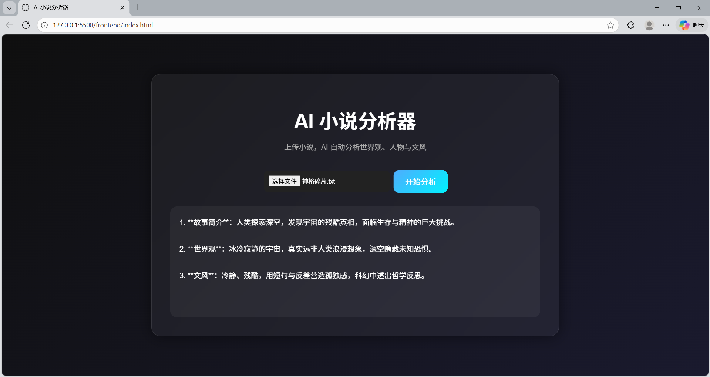

# 🚀 AI Novel Analyzer (小说世界观智能分析器)

[](https://fastapi.tiangolo.com/)
[](https://www.python.org/)
[](https://opensource.org/licenses/MIT)

一个基于 **FastAPI** 后端与现代前台网页构建的轻量级 **AI 小说文本分析工具**。用户只需上传小说的 `.txt` 或 `.docx` 格式文件，系统将通过大语言模型自动提取并分析小说的世界观、核心角色、修炼体系及剧情走向。

---

## 🌟 核心亮点

- **零临时文件（内存解析）**：采用 `io.BytesIO` 技术，`.docx` 文本直接在内存中流式解析，不写入服务器本地硬盘，无锁死风险、安全高效。
- **前后端分离架构**：后端基于高并发的 FastAPI 构建，前端采用原生极简 HTML5/CSS3/JavaScript，轻量且响应迅速。
- **大模型强力驱动**：无缝对接大模型（支持硅基流动 SiliconFlow 等高性价比 API），智能生成深度的小说设定报告。

---

## 🛠️ 技术栈

- **后端**: Python 3.11 + FastAPI + Uvicorn (长连接与流式支持)
- **文本解析**: `python-docx` (Word 内存流解析)
- **前端**: HTML5 + CSS3 (含动画加载特效) + Vanilla JS (原生 Fetch 异步通信)
- **大模型支撑**: DeepSeek-V3 / 硅基流动 API (Requests 异步调用)

---

## 📸 功能展示

*这里可以替换成你自己的网页运行截图：*


---

## 🚀 快速开始与安装教程

### 1. 克隆项目到本地
```bash
git clone [https://github.com/wangjisong-25/ai-novel-analyzer.git](https://github.com/wangjisong-25/ai-novel-analyzer.git)
cd ai-novel-analyzer